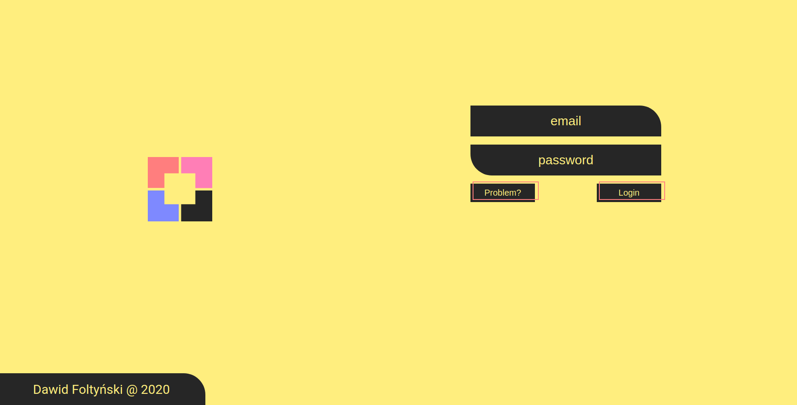
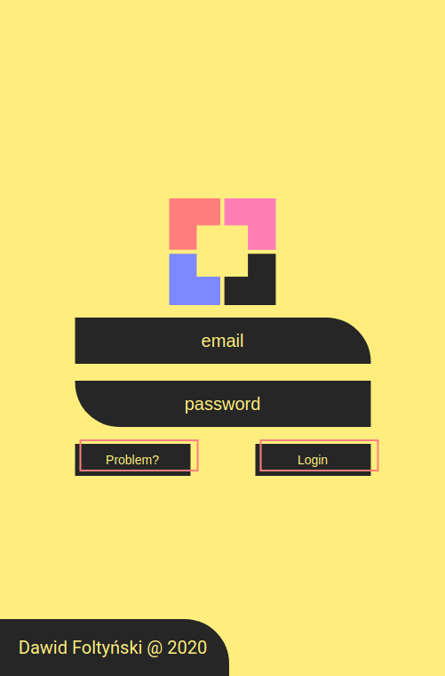

# 					Okti Private Server

## What is it about?

I just wanted to learn new things and finish one big project. You can compare it to Google drive, it's just my private server.

## How does it look like?

PC

Phone

